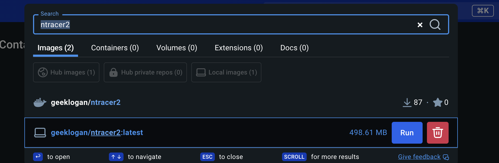
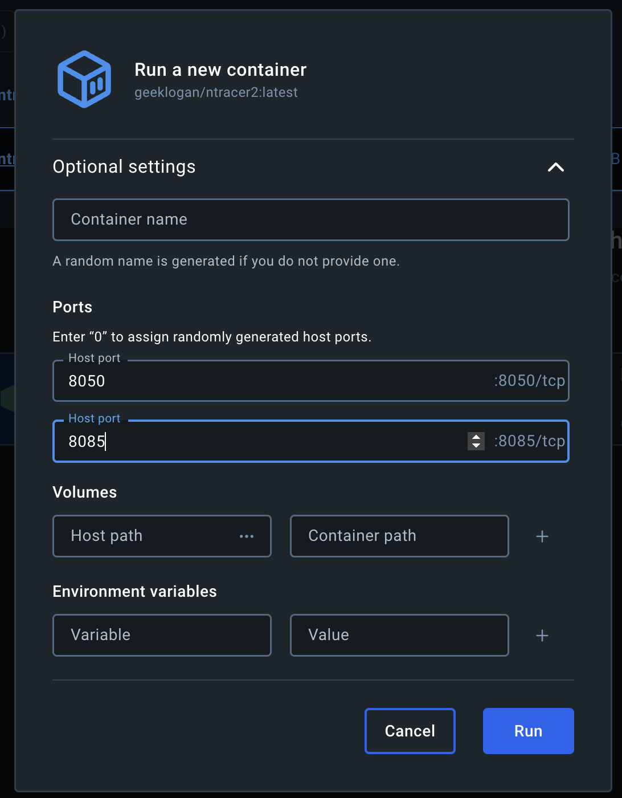
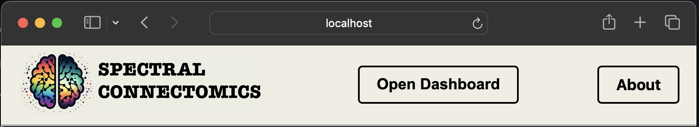
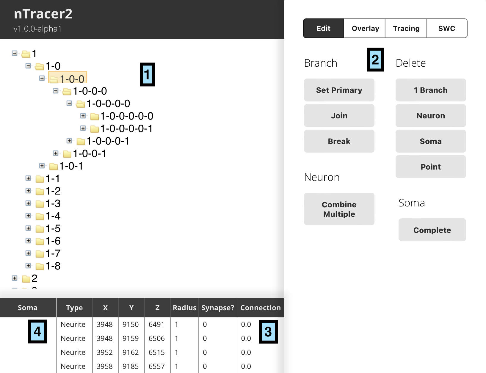
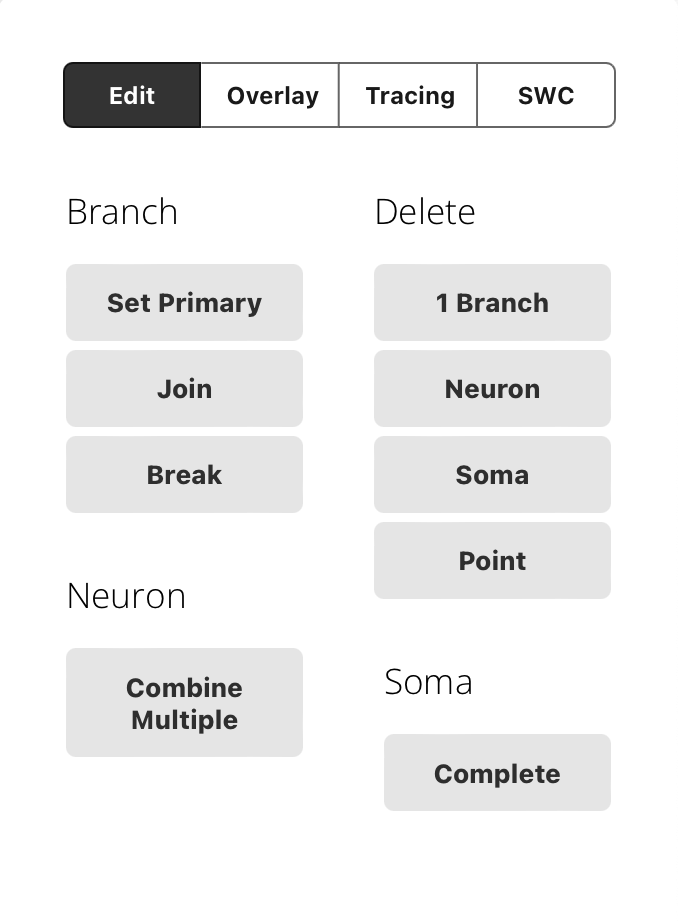
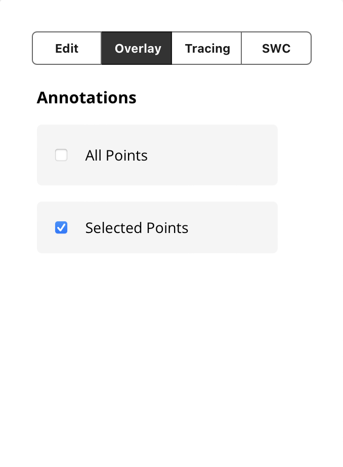
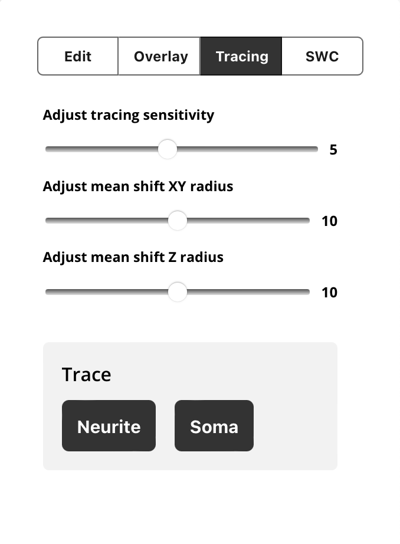
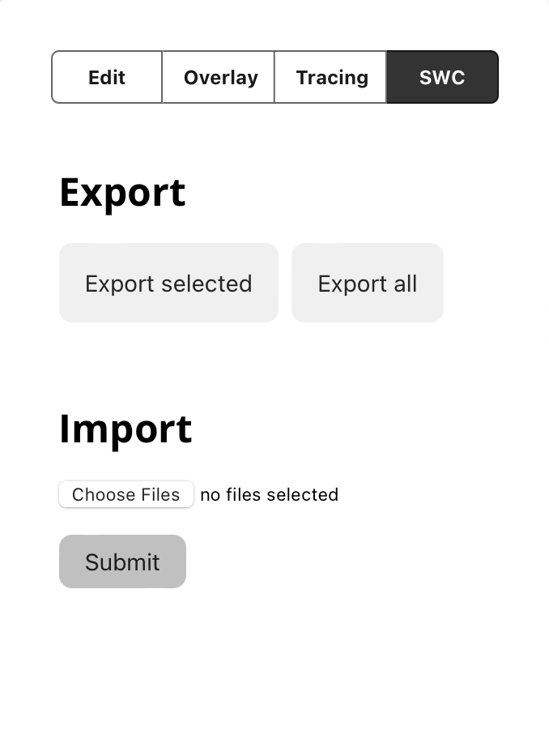

# nTracer2

[](https://zenodo.org/doi/10.5281/zenodo.13697098)

An interactive tool for reconstructing and analyzing complex neural networks from multi-color fluorescent images. This software is used in close conjunction with the nTracer2/SISF CDN software: [https://github.com/Cai-Lab-at-University-of-Michigan/SISF_CDN](https://github.com/Cai-Lab-at-University-of-Michigan/SISF_CDN)

## Citation

Pending...

## Quick Reference

### Hotkey Shortcuts

| Key Combination          | Command                                    |
|--------------------------|--------------------------------------------|
| Ctrl/Alt + right-click   | Deselect current selections.               |
| Ctrl + left-click        | Place selection box.                       |
| Alt + left-click         | Place selection box (with no auto shift)   |
| 2 x left-click           | Select nearest point to mouse              |
| A                        | Trace a neurite                            |
| S                        | Trace a soma                               |
| O                        | Complete a soma tracing                    |
| Ctrl + z                 | Undo                                       |
| Ctrl + y                 | Redo                                       |
| Alt + Scroll             | Change depth for which traces are shown.   | 

### Docker Parameters

The nTracer2 Docker image uses a collection of environment variables to specify what servers the software should connect to in order to perform different steps in the analysis and visualization of a dataset. This table provides a reference to the relevant ones for setting up nTracer2:

|  ENV Parameter    |    Build Parameter   |     Description       |  Default |
|-------------------|----------------------|-----------------------|----------|
| `DATASET_ID` | `dataset_id` | Name of the dataset to operate upon | `packed2`, an example published tracing dataset. |
| `NEUROGLANCER_PORT` | `neuroglancer_port`    | Server port used to expose the main nTracer2 UI interface | 8050 | 
| `SERVER_PORT` and `REACT_APP_SERVER_PORT` | `server_port`          | Port used for backend app communication | 8085 |
| `CDN_URL`           | `cdn_url` | The CDN URL used to access the **image data**. | `https://sonic2.cai-lab.org/data/` |
| `CDN_URL_HOST` | NA | The CDN URL that the host browser uses to access the **image data**. | Defaults to the value of `CDN_URL`, only use this if your CDN is hosted on the local PC, in which case it should be, e.g., `http://localhost:8080` where `8080` is the port forwarded to the CDN docker container. | 
| `CDN_URL_LOCAL` | NA | The CDN URL used to access the **tracing data**. | Defaults to the value of `CDN_URL`, only use this if your tracing data is located in a different location than the image data. |
| `CDN_URL_LOCAL_HOST` | NA | The CDN URL used by the host browser to access the **tracing data**. | Defaults to the value of `CDN_URL`, only use this if your tracing data is located in a different location than the image data **and** is hosted on the local PC, in which case it should be, e.g., `http://localhost:8080`. | 


## Installing and starting nTracer2

1. Before beginning, ensure that your compute has sufficient RAM and processing power to support nTracer2. We suggest a minimum of 8GB of RAM for a Mac and 16GB for Windows, however your experience may vary. Also ensure that you have a high speed internet connection, as low quality wi-fi is the most common cause of complaint

    - You can use tools like [fast.com](fast.com) to test your internet speed. Speeds under ~50mbps tend to lead to slow tracing experiences.

2. Next, ensure that you have an up-to-date docker or Docker-desktop installation on the compute that will be used for tracing. We package nTracer2 using Docker to allow it to be reproducibily run on many different machines and provide images for both ARM and AMD64 architectures. 32 bit architectures are not supported. We have found that using Docker in "WSL2" mode can prevent nTracer2 from starting properly, make sure to deselect this option when installing Docker. Also note that some security programs may prevent Docker from reaching the permissions required to

3. To run nTracer2, there is both a GUI (user interface) and command line option for starting the Docker image:

    - GUI Option (Docker Desktop):
        1. If you are using Docker Desktop, use the search box at the top of the window to search `nTracer2`.

        2. Select the "Run" button next to `geeklogan/ntracer2`, which is the Cai-lab prebuilt nTracer2 image: 

        3. When prompted, select ports to be used by the server, we recommend using the default values. It is also possible to provide a container name for the nTracer2 image: 

        4. Run the image and allow the image to start.

        5. If on Windows, you may be prompted to allow Docker to access the network. Make sure that both public and private networks are selected, or your image may be prevented from accessing required resources.

    - Command Line Option:
        - Navigate to the nTracer2 folder on your computer and execute: 
            ```
            docker compose build
            docker compose up
            ```

4. To specifying a different dataset or change the port used by the server, use the configuration table presented above in this guide. As a reference, here are three ways the server can be configured:
    1. One remote server hosts both image data and tracing database:
        - Set `DATASET_ID` to the name of the dataset of interest.
        - Change `CDN_URL` to the URL of the CDN server.
    2. One remote server hosts the image data and tracing database is served locally:
        - Set `DATASET_ID` to the name of the dataset of interest.
        - Change `CDN_URL` and `CDN_URL_HOST` to the URL of the remote server.
        - Change `CDN_URL_LOCAL` to the path to the CDN Docker container (example: `http://172.17.0.2:6000`).
        - Change `CDN_URL_LOCAL_HOST` to the path to the forwarded HTTP port from the CDN Docker container (example: `http://localhost:8080`).
    3. A local server hosts both the image data and the tracing database:
        - Set `DATASET_ID` to the name of the dataset of interest.
        - Change `CDN_URL` and `CDN_URL_LOCAL` to the path to the CDN Docker container (example: `http://172.17.0.2:6000`).
        - Change `CDN_URL_HOST` and `CDN_URL_LOCAL_HOST` to the path to the forwarded HTTP port from the CDN Docker container (example: `http://localhost:8080`).

5. Open a browser (Chrome or Chromium are recommended) and navigate to [localhost:8085/dashboard]( localhost:8085/dashboard) where `8085` can be replaced with an alternate port if chosen above.

6. The resulting window should show the tracing neuroglancer window with a custom border: 

7. Click "Open Dashboard" to open the nTracer2 tracing interface in another browser window. The application should now be ready to operate.


## Control Panel Layout

Familiarize yourself with different menu options and command buttons in the control panel. Most of the menus will display a short description as a rollover text. Some of the basic menus are briefly described below:



1.	**Trace heiarchy table.** In this user interface element, each neuron is displayed using a tree structure to visualize the branching of the cell. Each branch is named with the number of the neuron first, followed by the index of each branch. Each "folder" can be opened to reveal the downstream branches.

2.	**Toolbox (Tracing/Edit/Overlay).** Each table of this element contains a set of tools for interacting with the neuron tracing environment, as described one-by-one later in this page.

3.	**Traced Points Table.** This window displays the coordinates of each point which has been traced for the selected branch above, including the synapse and connectivity data corresponding to each point.

4.	**Soma Table.** Soma traces are organized and displayed by z-stack in this table. e.g, `1:100` means soma tracing of neuron #1 in image slice 100.


## Tracing Tutorial

Once the image file is loaded, you can begin tracing. You may start by tracing any neuron of your choosing. Here, we will start by tracing a clearly identifiable soma. The computer automatically determines the “best-fit” path between two points based on color and intensity information. 

### Soma tracing

The soma tracing method can be used to identify the 3D structure of a cell body 

1. First, `Alt-left click` anywhere on the soma outline. A red box will appear marking this point as the starting point.
2. Next, `Alt-left click` again to mark the end point of the trace. A blue box will appear marking this point as the ending point.
3. Press `s` or click "Soma" on tracing menu toolbox to execute the soma tracing method. This will perform an A* search between the start and end points.
4. The path will appear as a red line, and the end point automatically becomes the new starting point (red box).
5. Continue tracing by clicking along the somatic boundary in the same manner.
6. Before starting to trace the soma at a new z position, `Ctrl+right click` to deselect the last tracing you just made while keeping the root neuron selected. The red box from the previous slice will disappear and allow you to assign a new starting point on the new z position.
7. To finish, press “Complete” in the Soma(s) box in the editing dashboard or the 'o' key. The program automatically connects the most recent endpoint to the first starting point.

**Note:** You can undo tracing by pressing `Ctrl-z`, and redo tracing by pressing `Ctrl-y`. Upon creating a trace, you will see your first soma trace listed in the control panel.

AAAA
In this example, the trace was done for a soma in image slice #6326. This new entry created a new neuron <114> in the Tracing Diagram. Additional traces of this neuron will be listed under <114> as they are generated, and each entry will be accessible through the Soma and Tracing Points windows.

BBBB
For soma traces, entries appear as numbers in the form A:B. ‘A’ represents the neuron identity (1 as this trace is part of the first neuron to be traced) and ‘B’ represents the z- coordinate.

### Neurite Tracing

Below, we will describe how to perform neurite tracing in two forms: linear tracing where a single projection is traced, followed by branched tracing for handing bifurcation points.

#### Linear Tracing
While the soma can only be traced within each z slice, you can move freely through different z slices when tracing neurites. nTracer2 determines the path in-between the starting point and the end point in 3D.

Here, we will show you how to trace a neurite.
1.	`Ctrl + right-click` to deselect all previous entries. 
2.	Select a starting point. If tracing a projection from a soma, start from the soma by `double left-click` on the soma trace. If not, `Ctrl + left-click` where the neurite first appears with to define the starting point (red box).
3.	Follow the path of the neurite, scrolling through the z-stack if necessary, and `Ctrl + left-click` once more to set the end point (blue box). 
4.	Press the `a` hotkey to connect the points and create an entry as a neurite. The points should appear 
5.	Continue tracing by repeating the above steps until you reach the end of the neurite.

#### Branched Tracing

To perform branched tracing, you must first begin with a linear trace performed using the above.

1. Begin by selecting a bifurcation either by selecting a coordinate from the tracing table UI element or by using the `INSERT` key to select a neuron plotted in Neuroglancer.
2. Continue 

## Toolbox Utilities

### Neuron Editing



The neuron editing panel is grouped into four categories. The "Branch" utilities are used for manipulating the structure of branches, such as combining and spliting neuron branches. "Delete" tools can be used to remove tracing records from the table. The "Combine Multiple" button can be used for merging multiple neurons. Finally, the "Complete" button under Soma can be used for filling in the gaps in a Soma tracing.

### Modifying Overlay Settings



The Overlay toolbox gives you the option to change the visual output of the traces. You can adjust the overlay to help make the tracing process easier, create a convincing 3D representation of your data, highlight and/or hide different elements of traces. The "All Traced" button gives you the option of adjusting the overlay settings for your entire tracing. Select different components to have them in the image viewer. Selecting ‘All Points’ will show tracings from the entire stack as a single plane. The "Selected" button will adjust the overlay to only show the selected neuron.

### Tuning Tracing



The "Tracing" menu contains sensitivity settings for the tracing algorithms.

### SWC Export



The "SWC" menu can be used for exporting neurons or importing them using a SWC file.


## Quality of Life

### Adjusting Image Contrast

#### Example Single Channel Shader
```
#uicontrol vec3 color color(default="red")
#uicontrol float gamma slider(min=-10, max=10, step=0.01, default=1)
#uicontrol invlerp normalized
  
void main() {
  float ival = normalized();
  ival = pow(ival, gamma);
  vec3 val = color * ival;
  
  emitRGB(val);
}
```

#### Example Multi-channel Shader (default)
```
#uicontrol bool channel_1 checkbox(default=true)
#uicontrol bool channel_2 checkbox(default=true)
#uicontrol bool channel_3 checkbox(default=true)
#uicontrol bool channel_4 checkbox(default=true)

#uicontrol vec3 color_channel_1 color(default="red")
#uicontrol float brightness_channel_1 slider(min=-1, max=1, step=0.01)
#uicontrol float contrast_channel_1 slider(min=-10, max=10, step=0.01, default=4)
#uicontrol float gamma_channel_1 slider(min=-3, max=3, step=0.01, default=1)

#uicontrol vec3 color_channel_2 color(default="green")
#uicontrol float brightness_channel_2 slider(min=-1, max=1, step=0.01)
#uicontrol float contrast_channel_2 slider(min=-10, max=10, step=0.01, default=4)
#uicontrol float gamma_channel_2 slider(min=-3, max=3, step=0.01, default=1)

#uicontrol vec3 color_channel_3 color(default="blue")
#uicontrol float brightness_channel_3 slider(min=-1, max=1, step=0.01)
#uicontrol float contrast_channel_3 slider(min=-10, max=10, step=0.01, default=4)
#uicontrol float gamma_channel_3 slider(min=-3, max=3, step=0.01, default=1)

#uicontrol vec3 color_channel_4 color(default="blue")
#uicontrol float brightness_channel_4 slider(min=-1, max=1, step=0.01)
#uicontrol float contrast_channel_4 slider(min=-10, max=10, step=0.01, default=2)
#uicontrol float gamma_channel_4 slider(min=-3, max=3, step=0.01, default=1)

#uicontrol float gamma_global slider(min=-3, max=3, step=0.01, default=1)

void main() {
    vec3 val = vec3(0,0,0);
    vec3 toadd = vec3(0,0,0);

    if(channel_1) {
        toadd = color_channel_1 * (toNormalized(getDataValue(0))) * exp(contrast_channel_1);
        toadd += color_channel_1 * brightness_channel_1;
        toadd = pow(toadd, vec3(gamma_channel_1,gamma_channel_1,gamma_channel_1));
        val += toadd;
    }
    if(channel_2) {
        toadd = color_channel_2 * (toNormalized(getDataValue(1))) * exp(contrast_channel_2);
        toadd += color_channel_2 * brightness_channel_2;
        toadd = pow(toadd, vec3(gamma_channel_2,gamma_channel_2,gamma_channel_2));
        val += toadd;
    }
    if(channel_3) {
        toadd = color_channel_3 * (toNormalized(getDataValue(2))) * exp(contrast_channel_3);
        toadd += color_channel_3 * brightness_channel_3;
        toadd = pow(toadd, vec3(gamma_channel_3,gamma_channel_3,gamma_channel_3));
        val += toadd;
    }
    if(channel_4) {
        toadd = color_channel_4 * (toNormalized(getDataValue(3))) * exp(contrast_channel_4);
        toadd += color_channel_4 * brightness_channel_4;
        toadd = pow(toadd, vec3(gamma_channel_4,gamma_channel_4,gamma_channel_4));
        val += toadd;
    }

    val =  pow(val,vec3(gamma_global,gamma_global,gamma_global));
    
    emitRGB(val);
}
```